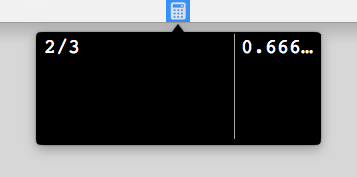

## JAMBC

Just Another Menu Bar Calculator

#### Built With
JAMBC is built with a slightly modified version of DDMathParser to use ^ for pow instead of xor

* [DDMathParser](https://github.com/davedelong/DDMathParser) - makes it easy to parse a String and evaluate it as a mathematical expression.
* [Popup](https://github.com/shpakovski/Popup) -  Cocoa project with Popup window appearing from the status bar

#### License

This project is licensed under the MIT License
